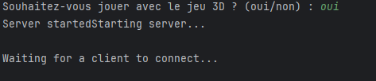
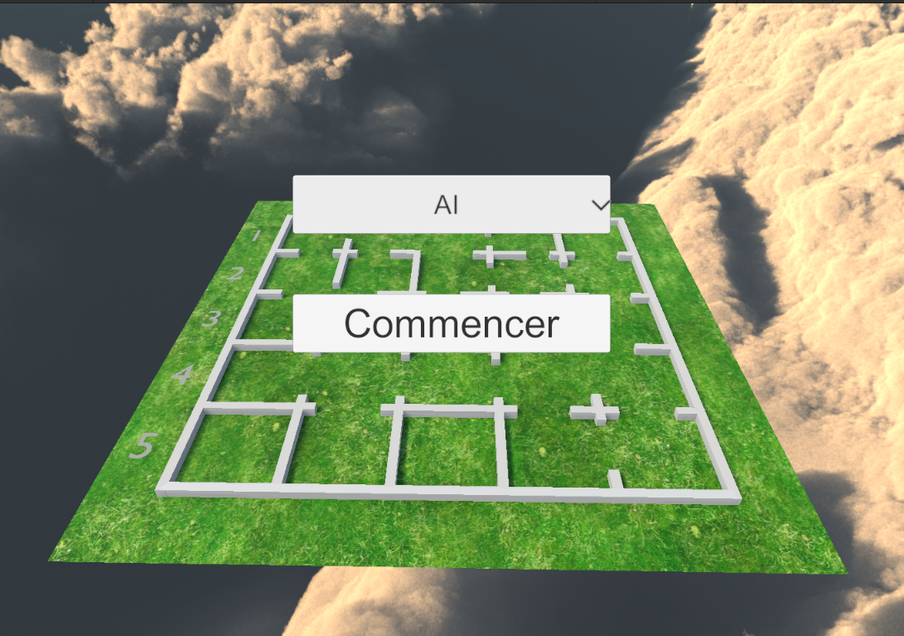
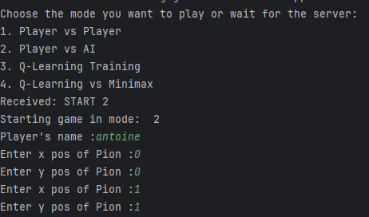

# Projet de Jeu 3D avec IA

Bienvenue dans le projet de jeu 3D intégrant une IA ! Ce guide vous accompagnera dans l'installation, la configuration et l'utilisation du jeu Unity.

---

## Prérequis

Avant de commencer, assurez-vous d'avoir les éléments suivants :  
- [Unity](https://unity.com/) installé sur votre machine.  
- [Python](https://www.python.org/) installé sur votre machine.  
- Les bibliothèques Python nécessaires installées (voir les dépendances dans le fichier `requirements.txt` du projet).  
- Un compte Git configuré pour cloner le dépôt.

---

## Étapes d'installation

1. **Cloner le dépôt GitHub**  
   Téléchargez le dépôt du jeu 3D si vous ne l'avez pas déjà :  
   ```bash
   git clone -b main https://github.com/AntoineMilochevitch/Santorini3D.git
    ```
2. **Ouvrir la scnène Unity**  
   Ouvrez Unity Hub et ajoutez le dossier du jeu 3D.  
   Ouvrez la scène `Santorini` pour commencer à travailler sur le projet.

## Utilisation
1. **Exécuter le script Python**  
   - Exécutez le script Python `main.py` pour lancer le serveur.  
        ```bash
        python main.py
        ```
   - Lorsque le script vous demande si vous souhaitez utiliser le jeu 3D répondez `oui`.
   
2. **Lancer le jeu Unity**  
   Appuyez sur le bouton `Play` dans Unity pour lancer le jeu.  

3. **Choisir le mode de jeu dans Unity**  
   Dans le menu du jeu Unity, sélectionnez le mode AI (c'est le seul mode implémenté pour l'instant).  
   Cliquez sur `Commencer`.
    

4. **Configurer les informations sur Python**
    Renseignez dans le terminal python :
    - Le nom du joueur
    - Les positions de base des pions du joueur
   

5. **Jouer au jeu**
    Vous pouvez maintenant jouer au jeu en 3D avec unity.


